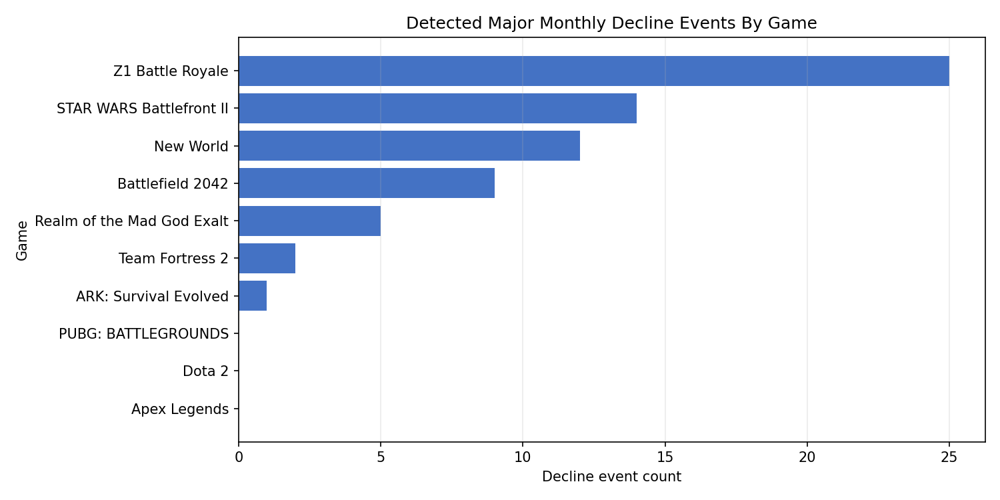
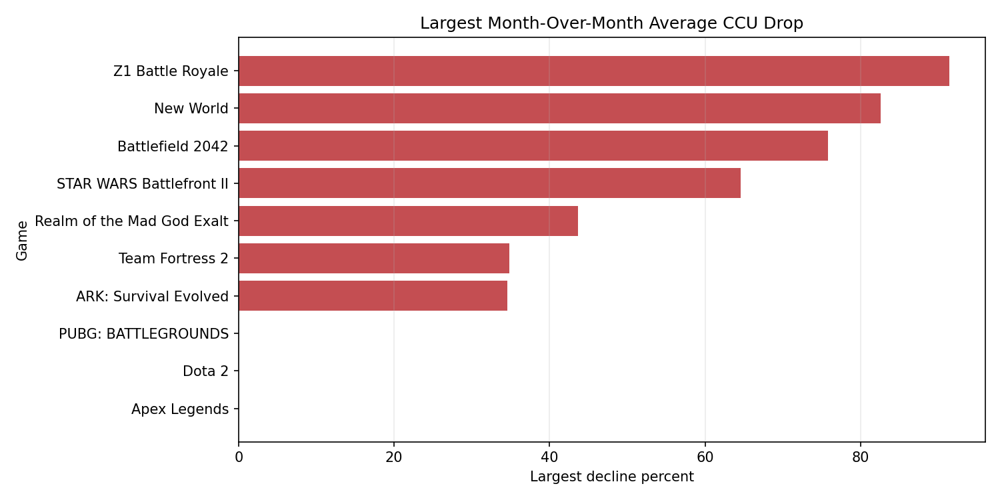
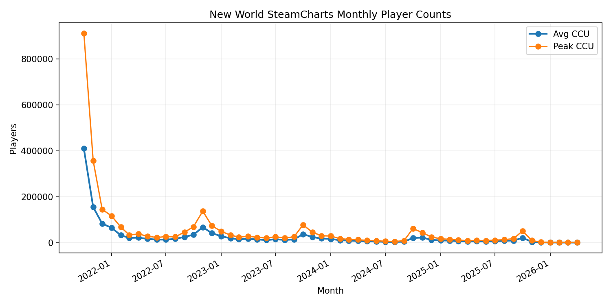
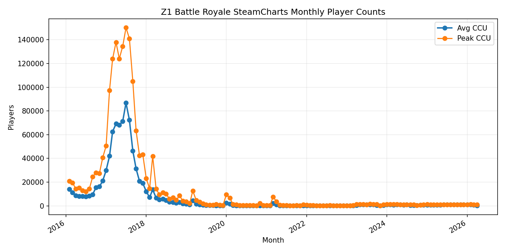
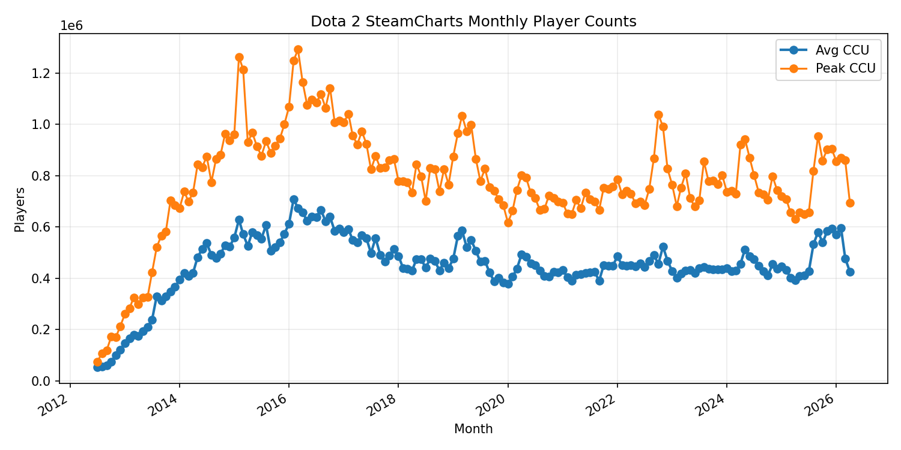

# Steam Game Decline Analysis

Can public Steam-facing data help identify when multiplayer games enter major player-count decline periods?

This project is a reproducible data science pipeline for studying multiplayer game decline on Steam. It collects public player-count and metadata sources, normalizes them into analysis-ready tables, detects major monthly decline events with a fixed rule, and produces a final report with cross-game comparisons.

The goal is not to claim that one update, review trend, or controversy caused a game to decline. The goal is more defensible: detect major decline periods and show what public signals were visible around them.

## Project Snapshot

| Area | Details |
| --- | --- |
| Games analyzed | 10 Steam multiplayer games |
| Player-count source | SteamCharts monthly average and peak concurrent players |
| Metadata source | SteamSpy owner ranges, review counts, tags, developer/publisher metadata |
| Analysis unit | Monthly average concurrent players |
| Decline rule | Month-over-month average-player drop of at least 30% |
| Processed rows | 1,109 monthly player-count records |
| Detected events | 68 major monthly decline events |
| Outputs | Processed CSVs, validation checks, charts, notebooks, Markdown/HTML report |

## Screenshots

### Decline Events By Game



### Largest Monthly Drop By Game



### New World Player Timeline



### Z1 Battle Royale Player Timeline



### Dota 2 Control Timeline



## Why This Project Exists

Multiplayer games often decline in visible waves: launch drop-off, bad updates, content droughts, competitor releases, platform shifts, or simple long-term decay. The hard part is that most public discussion turns this into a vague story.

This project turns the question into something measurable:

> Given public Steam-facing data, which games show major monthly player-count drops, and how do those drops compare across games?

That framing keeps the project honest. It supports trend analysis and event comparison, but avoids pretending that public data alone proves causation.

## What The Pipeline Does

1. Loads configured Steam games from `config/games.yaml`.
2. Fetches SteamCharts monthly player-count history.
3. Fetches SteamSpy metadata for owner ranges, tags, and review context.
4. Optionally fetches Steam announcements and review snapshots.
5. Normalizes raw sources into consistent interim and processed CSV files.
6. Detects major monthly decline events using a fixed threshold.
7. Builds cross-game summaries and monthly feature tables.
8. Validates processed outputs for duplicate rows and invalid event windows.
9. Generates figures and a final Markdown/HTML report.

## Key Findings From Current Run

The current processed dataset covers all 10 configured games:

| Game | Decline Events | Largest Monthly Drop | Latest vs Peak Avg CCU |
| --- | ---: | ---: | ---: |
| Z1 Battle Royale | 25 | 91.41% | -99.73% |
| STAR WARS Battlefront II | 14 | 64.60% | -88.68% |
| New World | 12 | 82.56% | -99.86% |
| Battlefield 2042 | 9 | 75.83% | -97.28% |
| Realm of the Mad God Exalt | 5 | 43.66% | -65.16% |
| Team Fortress 2 | 2 | 34.78% | -57.38% |
| ARK: Survival Evolved | 1 | 34.55% | -82.01% |
| Apex Legends | 0 | 0.00% | -51.68% |
| Dota 2 | 0 | 0.00% | -39.94% |
| PUBG: BATTLEGROUNDS | 0 | 0.00% | -77.72% |

Interpretation matters here. A 30% monthly drop is meaningful for spotting decline periods, but it is not automatically a failure label. Some games recover, some have platform effects, and some Steam histories do not represent the full playerbase.

## Technical Highlights

- Built a source-specific scraping pipeline for SteamCharts and SteamSpy.
- Preserved raw snapshots separately from normalized outputs.
- Converted inconsistent public sources into clean, analysis-ready tables.
- Used rule-based event detection for reproducibility.
- Added validation checks for duplicate metric rows, invalid event dates, and broken event-window references.
- Generated report-ready plots using Matplotlib.
- Kept the pipeline runnable from scripts and inspectable through notebooks.

## Repository Structure

```text
game analysis/
  config/
    analysis.yaml
    event_taxonomy.yaml
    games.yaml

  data/
    raw/                 # ignored raw source snapshots
    interim/             # normalized source-level outputs
    processed/           # analysis-ready CSV outputs

  notebooks/
    00_data_availability.ipynb
    01_player_decline_detection.ipynb
    02_review_sentiment_overlay.ipynb
    03_event_annotation_analysis.ipynb
    04_cross_game_comparison.ipynb

  reports/
    figures/
    steam_decline_analysis.md
    steam_decline_analysis.html

  scripts/
    check_data_availability.py
    fetch_raw_data.py
    build_processed_data.py
    run_analysis.py
    validate_outputs.py
    build_report.py

  src/game_decline/
    steam/               # source fetchers
    processing/          # normalization pipeline
    analysis/            # decline detection and summaries
    visualization/       # chart generation
    report/              # report builder
```

## Reproduce The Project

Set up the environment:

```powershell
python -m venv .venv
.\.venv\Scripts\Activate.ps1
pip install -r requirements.txt
pip install -e .
```

Run the full pipeline:

```powershell
python scripts/check_data_availability.py
python scripts/fetch_raw_data.py --scope all --no-reviews --no-announcements
python scripts/build_processed_data.py
python scripts/run_analysis.py
python scripts/validate_outputs.py
python scripts/build_report.py
```

Run tests:

```powershell
pytest tests -q
```

## Main Outputs

- `data/processed/game_summary.csv`
- `data/processed/game_daily_metrics.csv`
- `data/processed/monthly_features.csv`
- `data/processed/decline_events.csv`
- `data/processed/decline_summary.csv`
- `data/processed/event_windows.csv`
- `reports/figures/`
- `reports/steam_decline_analysis.md`
- `reports/steam_decline_analysis.html`

## Data Sources

- SteamCharts: monthly average and peak concurrent-player history.
- SteamSpy: owner estimates, review counts, tags, and metadata context.
- Steam announcements: optional public update/event context.
- Manual event annotations: supported under `data/raw/external_events/`.
- Kaggle/Mendeley datasets: supported as future expansion sources under `data/raw/third_party_datasets/`.

## Limitations

- SteamCharts is monthly, so the project cannot make precise daily claims.
- Steam-only data may miss console, launcher, regional, or non-Steam playerbases.
- SteamSpy owner counts are estimates, not exact measurements.
- Public data can show timing and correlation, not causation.
- Event annotations are still the weakest part of the project and should be expanded before making stronger interpretive claims.

## Why This Is Recruiter-Relevant

This repo demonstrates the full data science loop: messy public data collection, reproducible processing, feature engineering, rule-based analysis, validation, visualization, and clear reporting. The important part is not just that charts exist. The project has a defensible question, a repeatable pipeline, and explicit limits on what the data can prove.
